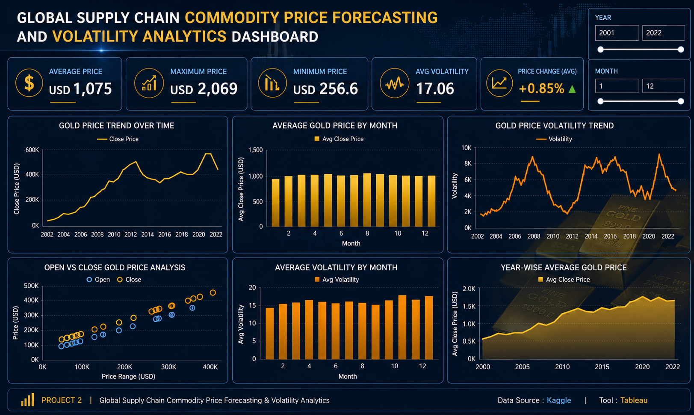

# 🪙 Global Supply Chain Commodity Price Forecasting & Volatility Analytics

<p align="center">


</p>

---

## 📌 Project Overview

This project focuses on forecasting commodity prices using historical gold market data and Machine Learning techniques. It analyzes historical trends, performs data preprocessing, builds a predictive model, evaluates its performance, and presents insights through an interactive Tableau dashboard.

---

## 🎯 Project Objectives

- Forecast future commodity prices using Machine Learning.
- Analyze historical gold price trends.
- Perform feature engineering and data preprocessing.
- Evaluate model performance using regression metrics.
- Build an interactive Tableau dashboard for business insights.

---

## 🛠️ Technology Stack

| Category | Technologies |
|-----------|--------------|
| Programming | Python |
| Data Analysis | Pandas, NumPy |
| Visualization | Tableau, Matplotlib |
| Machine Learning | Scikit-learn |
| Development | Jupyter Notebook |
| Version Control | Git & GitHub |

---

## 📊 Dataset Information

| Item | Details |
|------|---------|
| Dataset | Historical Gold Price Dataset |
| Source | Kaggle |
| File | `gold.csv` |

---

## 🔄 Project Workflow

```text
Data Collection
        │
        ▼
Data Preprocessing
        │
        ▼
Feature Engineering
        │
        ▼
Exploratory Data Analysis
        │
        ▼
Machine Learning Model
        │
        ▼
Model Evaluation
        │
        ▼
Gold Price Forecasting
        │
        ▼
Tableau Dashboard
```

---

## 📂 Project Structure

```text
Global-Supply-Chain-Price-Forecasting/
│
├── README.md
├── gold.csv
├── gold_csv.ipynb
├── gold_price_forecasting.ipynb
├── gold_price_forecasting_model.pkl
├── Tableau Dashboard.png
├── Report_Global Supply Chain Commodity Price Forecasting.pdf
└── PPT_Commodity Price Forecasting & Volatility Analytics.pdf
```

---

## 🤖 Machine Learning

The forecasting model was trained using historical commodity price data to predict future gold prices.

### 📈 Model Performance

| Metric | Score |
|---------|-------|
| MAE | **2.98248** |
| MSE | **21.96412** |
| RMSE | **4.68659** |
| R² Score | **0.9999219** |

✅ The model achieved excellent prediction accuracy with a very high R² Score.

---

## 📊 Tableau Dashboard Features

The Tableau dashboard provides:

- 📈 Historical Gold Price Trends
- 📅 Monthly & Yearly Analysis
- 📊 Forecast Visualization
- 📉 Price Distribution
- 📌 Key Performance Indicators (KPIs)

---

# 🖼️ Dashboard Preview



---

## 📁 Repository Files

| File | Description |
|------|-------------|
| `gold.csv` | Historical Gold Price Dataset |
| `gold_csv.ipynb` | Data preprocessing and feature engineering |
| `gold_price_forecasting.ipynb` | Complete Machine Learning workflow |
| `gold_price_forecasting_model.pkl` | Trained ML model |
| `Tableau Dashboard.png` | Tableau Dashboard |
| `Report_Global Supply Chain Commodity Price Forecasting.pdf` | Detailed Project Report |
| `PPT_Commodity Price Forecasting & Volatility Analytics.pdf` | Project Presentation |

---

## 🚀 Future Improvements

- Deploy the forecasting model using Streamlit.
- Integrate live commodity price APIs.
- Compare multiple forecasting algorithms.
- Improve forecasting accuracy using ensemble models.
- Automate dashboard updates.

---

## 👩‍💻 Author

### **Nazeera Bhanu**

**Aspiring Data Analyst**

### Skills

- Python
- SQL
- Excel
- Tableau
- Power BI
- Machine Learning
- Data Analysis
- Data Visualization

GitHub: https://github.com/nazeerashayara-arch

---

## ⭐ Support

If you found this project useful, consider giving this repository a ⭐ on GitHub.

---